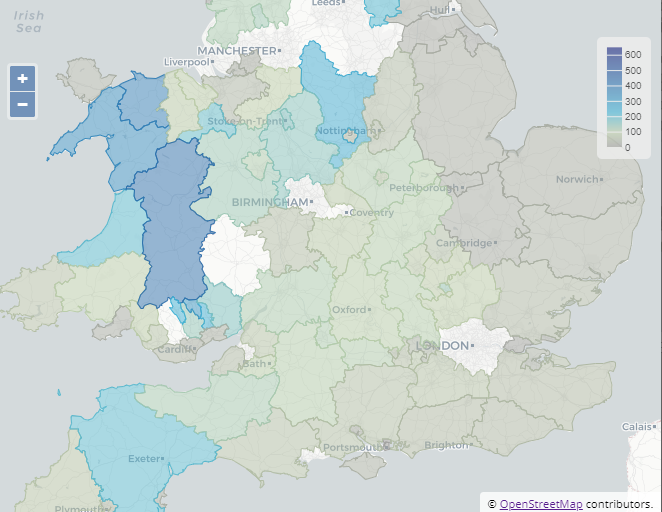

# Perspective Viewer Plugin Template

A mapp view plugin for [Perspective](https://github.com/jpmorganchase/perspective)

## Setup

```
  yarn
  yarn start
```

or with npm:

```
  npm install
  npm run start
```

## About the plugin

It uses [OpenLayers](https://openlayers.org/) and [OpenStreetMap](https://www.openstreetmap.org/#map=13/51.1366/-3.6823) to display data as a map view.

See the "making-of" blog article [Perspective Plugin API - How to build a new plugin](https://blog.scottlogic.com/2019/04/23/perspective-plugin-api-how-to-build-a-new-plugin.html);

## Point maps

The "Map Points" view requires a "Longitude" and "Latitude" parameter to show the data as points on the map.


## Region maps

The "Map Regions" view doesn't need coordinates, but requires a boundary map to associate with the data. It matches the "group" to the region and color codes the region.



For example, if "Group By" is "Country", you'll need to register a map boundary source with the command:

```
  registerMapRegions({
      name: "Country", 
      url: "https://opendata.arcgis.com/datasets/252471276c9941729543be8789e06e12_0.kml",
      key: "Country"
  });
```

- **name** is the name of the parameter in the "Group By" field
- **url** is the boundary data file to load
- **key** is the name of the property in the boundary data that identifies the region - e.g. the country name in this example
- **format** (optional) specifies the format for loading the features. Defaults to KML, which is:

```
  // KML format (remove syles so they can be applied by the plugin)
  format = new KML({extractStyles: false})
```

See the OpenLayers documentation for more information about [FeatureFormat](https://openlayers.org/en/latest/apidoc/module-ol_format_Feature-FeatureFormat.html)

## Themes

Perspective viewer itself, and the map plugin can be themed.

The plugin includes a dark-theme file `maps.plugin.dark.css`, with some default theme variables. Alternatively, you can override specific theme variables using a style block:

```
  <style>
    perspective-viewer {

      // Change the first 2 categories to red and green
      --map-category-1: #ff0000;
      --map-category-2: #00ff00;

      // Change the color gradient to blue-grey-red
      --map-gradient: linear-gradient(#0000ff 0%, #a0a0a0 50%, #ff0000 100%);

      // Change the source url for the map tiles
      --map-tile-url: "http://{a-c}.basemaps.cartocdn.com/light_all/{z}/{x}/{y}.png"
    }
  </style>
```

## Examples

[UK MetOffice Sites](https://bl.ocks.org/DevAndyLee/0efd87f7c0b8725a1c6bef8eafe86103) plotted by lat/long or region

[NewYork Citibikes](http://bl.ocks.org/DevAndyLee/57720f373752cd405dbbceb6f22c7854) map showing a live-updated view of Citibikes availability

[World Airports](https://bl.ocks.org/DevAndyLee/86b33055dbce1ccc709cb3238227bec1) plotted by lat/long or region
